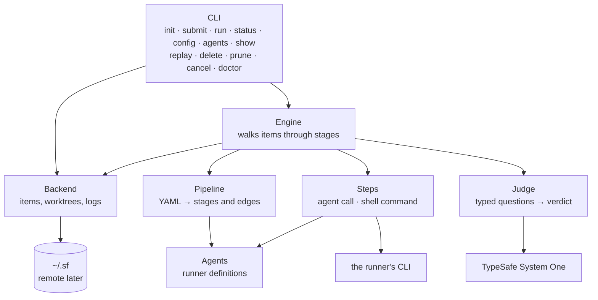

# Internals

How the code is put together, and the one contract inside it that is meant to be
reimplemented. Read this before changing the engine, or before writing a storage backend
that is not a local directory.

## Architecture

Seven modules and a CLI, one file each, none of them clever.



**Config** resolves one global installation under `~/.sf` — defaults, then
`config.yaml`, then environment, then flags. There is one backend and one worktree root for
the whole machine; what varies per request is the repo.

**Pipeline** reads the YAML, resolving a name against the repo's own `.sf/pipelines/` before the
installation-wide one, so two repos can
both have a `dev` and mean different files. It rejects a pipeline that names a stage that does not
exist, a `uses:` that resolves to no runner, or a `with:` missing what that runner requires,
and answers one question for the engine: *given this stage and this verdict, where next, and
is that backwards?*

**Backend** owns storage, behind an interface the engine cannot see past: create, load,
save, all, claim, workspace, write_artifact, read_artifact, delete. The local implementation
is one JSON file per request, written atomically by rename, so a crash mid-write cannot leave
a corrupt item and two workers can never contend — they are never writing the same file. A remote implementation
drops in beside it; [the storage backend](#the-storage-backend) below is the contract.

**Steps** knows the two ways the factory does work itself. An agent step assembles a prompt
from the role prompt plus the request, its notes and its recent history, invokes whatever
argv the runner describes in the workspace, and extracts the verdict. A command step runs a
shell command and reads its exit code — or a verdict object on its stdout. Both return the
same small dictionary — verdict, notes, cost, and a bag of **artifacts** — which is what lets
the engine stay ignorant of the difference, and what makes every step inspectable afterwards regardless of its kind.

**Agents** is the runner registry: a `uses:` name resolved to a YAML file describing an argv
to build and a reply to read, looked up the way a pipeline is — the repo's own `.sf/runners/`, the
installation's, then the packaged ones. The shipped `claude` is an ordinary entry there and
gets no special treatment, which is the only way to know the seam is real.

**Engine** is the loop: take a queued request, run its current stage, record the result in
history, park it if the verdict says `human`, otherwise route it, count the pass if the route
goes backwards, and repeat until it hits a terminal state.

### Parallelism and isolation

One thread pool, one task per request. Each task walks its own request through its stages in
order; the parallelism is *across* requests, never within one. That choice is what keeps the
engine short — there is no coordination to write, because there is nothing to coordinate.

Isolation is structural rather than enforced:

- Each request gets a **git worktree on its own branch**, at
  `~/.sf/worktrees/<repo>/<request>`, so two agents editing the same file for different
  requests never see each other — whether those requests are for the same repo or different
  ones. The diff on that branch is the deliverable.
- Each request has its **own state file**, so concurrent writes never touch the same bytes.
- A request is **claimed** before it is walked — a compare-and-set from `queued` to
  `running`. Two engines pointed at the same storage cannot both work the same request.
- Isolation stops at the request, deliberately. **Inside** one request the stages share a
  Claude Code session by default: `resume: true` means the coder picks up the conversation
  the planner left, and the whole line is one conversation.

That last point is the trade, and it goes the other way from the rest of this section. The
implementer does remember being the planner, so the plan it is implementing is already in
context and is not read and billed a second time, which on a five-stage line is a large part
of the token bill. The prompt is still assembled and sent in full every time: the request, the
declared inputs and every accumulated note go over again, because they are what says *why*
the work came back. Resuming adds history; it never replaces the record.

The cost is that a stage's judgement can be coloured by the conversation that produced the
work, which is exactly wrong for a reviewer — a reviewer continuing the coder's session is
reviewing its own work. `resume: false` is the opt-out, and `review` is the one stage in the
shipped `dev` pipeline that declares it. The three settings and when to reach for each are in
[pipelines.md](pipelines.md#sessions-and-cost).

What survives either way is that the record, not the session, is the truth. Every prompt and
every reply is written to the backend as it happens, a dead session id is never fatal (the
call is retried cold), and a stage can still be read back, argued with, or swapped for a
different tool from its artifacts alone.

### Concurrency, honestly

Several Claude Code instances run against one subscription, and that subscription has rate
limits. The pipeline's `concurrency` is a knob to tune against those limits, not to maximise.
The default is 2.

### Deliberate omissions

No database — a directory of JSON files is inspectable with `cat` and survives the process.
No broker — `sf daemon` is one engine on one machine, looping `engine.run` on an interval;
there is still no distributed scheduling across machines. No web UI.

Retries are the one place that softened, and only as far as a blip warrants. An agent reply
the engine cannot use at all — an empty response, an overloaded API, output that is not JSON
— is sent again up to three times, two seconds then four between attempts, and the step
records `attempts.txt` when it took more than one. A judge's HTTP call is retried once, on a
5xx or a connection failure. Everything else still fails the request for a human to look at:
a non-zero exit from `claude` is configuration rather than weather, a 4xx is the key or the
questions, and a reply that parsed but did not decide is parked rather than re-rolled until
it says something convenient.

Each of those is a real feature the day the PoC's limits are the actual problem. None of them
is a feature today, and every one of them would have made the interesting part — the pipeline
model — harder to see.

## The storage backend

Work items have to live somewhere. Today that is a directory of JSON files on the
machine running the engine. It will not stay that way — a factory worth running is a
factory several people and several machines can see — so the boundary exists now, and
the local implementation sits behind it like any other.

This section is the contract. `software_factory/backend.py` is the same contract with types on it,
and `tests/test_backend_contract.py` is the same contract you can run.

### The nine operations

The engine knows nine operations and nothing else about storage. The table is the shape; the
sections after it are the contract — for each operation, what it must guarantee, what it may
assume, and what it must never do.

| Operation | What it does |
|---|---|
| `create` | Allocate an id, persist a new queued item, record its repo |
| `load` | Fetch one item |
| `save` | Persist an item |
| `all` | Every item, oldest first |
| `claim` | Compare-and-set `queued → running` |
| `workspace` | A local worktree for one request of one repo |
| `write_artifact` | Store one artifact of one step, return a reference |
| `read_artifact` | Read one back by that reference |
| `delete` | Remove an item and everything stored for it. Idempotent |

#### `create(request, pipeline, start_stage, repo, name="") -> item`

Allocate an id and persist a new item in `queued` at `start_stage`, with `passes` at 1
and empty `notes` and `history`. Return it.

- **Guarantees.** The id is unique across the installation, forever. Two concurrent
  callers never receive the same one, and an id that has been deleted is never handed
  out again — a deleted request's `sf/<id>` branch and its commits outlive its
  record, and `workspace()` resets that branch with `git worktree add -B`.
- **May assume.** `repo` is a path the caller can reach; the backend only records it.
  It may be empty.
- **Never.** Reuse an id, pad it, or make it anything but a decimal integer in a string —
  it goes in a branch name, a directory name and every listing.

#### `load(item_id) -> item`

Return one item as a plain dictionary.

- **Guarantees.** Always a whole item, never a partial one, even while a `save` is in
  flight. Raises if the id is not there.
- **May assume.** The caller mutates the dictionary it gets and hands it back to `save`.
  Two callers must not share one object, so the returned item is not cached or aliased.
- **Never.** Invent a missing item, or return one that was deleted.

#### `save(item) -> item`

Persist an item under its own `id`. Return it.

- **Guarantees.** Atomic (see below). A save whose `status` is anything but `running`
  releases the claim, so the item can be claimed again.
- **May assume.** `item["id"]` came from `create`, and the item is JSON-serialisable.
- **Never.** Merge, validate or rewrite the item — the engine owns its shape. In
  particular the backend does not resolve concurrent writes: the engine holds the claim,
  and holding the claim is what makes it the only writer.

#### `all() -> [item]`

Every item, oldest first — which is id order, numerically.

- **Guarantees.** Deleted items are absent. Ordering is by id as an integer, so 10 sorts
  after 2.
- **May assume.** Callers read the whole list; there is no pagination and, at the scale
  one installation reaches, no need for one.
- **Never.** Include tombstones, half-written items, or anything the caller would have to
  filter itself.

#### `claim(item) -> bool`

Compare-and-set `queued → running`. True if this caller won.

- **Guarantees.** Exactly one caller wins (see below). A winner leaves the item saved as
  `running`.
- **May assume.** The caller passes an item it just loaded, and will walk it if it wins.
- **Never.** Block, retry, or wait for the current holder. A loser is told no and moves
  to the next item.

#### `workspace(item_id, repo) -> path`

The directory agents work in for this request. Created on first call.

- **Guarantees.** A path on the **local** filesystem (see below) that a subprocess can
  `cd` into, and the same path on every later call for the same request.
- **May assume.** One request works in one repo for its whole life, and ids are unique,
  so the path can be derived rather than stored.
- **Never.** Return a URL, a handle, or a path that only exists on another machine.

#### `write_artifact(item_id, step_no, slug, name, text) -> ref`

Store one artifact of one step execution. Return a reference the engine records in the
item's history.

- **Guarantees.** The reference is an opaque string, and `read_artifact` accepts it
  verbatim. Two executions of the same stage, or two artifacts of the same name in
  different steps, get different references.
- **May assume.** The artifact is text and arrives whole, as content — never as a path.
- **Never.** Overwrite a previous step's artifact, or leak the storage layout into the
  reference in a way the engine has to parse. The engine only stores it and hands it back.

#### `read_artifact(item_id, ref) -> text`

Read one back by the reference `write_artifact` returned.

- **Guarantees.** Byte-for-byte what was written.
- **May assume.** `ref` came from this backend's own `write_artifact`.
- **Never.** Return an empty string for an artifact that is gone — raise. `sf replay`
  would otherwise render a missing step as an empty one.

#### `delete(item_id)`

Remove an item and everything this backend stored for it.

- **Guarantees.** Idempotent — deleting an id that is not there is not an error, because
  a remote backend cannot promise the caller saw the latest state. Afterwards the id is
  absent from `all()` but still spent, so `create` never reissues it.
- **May assume.** The caller has already stopped anything running against the item.
- **Never.** Delete the request's git branch. Cancelling drops the checkout, not the
  commits.

### The four guarantees

The engine leans on these instead of doing any locking of its own.

**`create` allocates a unique id.** Two `sf submit` calls at once must not be given
the same one. The local backend gets this by creating the item's directory with `mkdir`,
which fails if it already exists — the same compare-and-set `claim` gets from `O_EXCL`;
the loser recomputes and takes the next id. A remote backend uses a sequence, an insert
that fails on a duplicate key, or whatever its store already has. Ids of deleted items
stay spent: the local backend leaves a `<id>.deleted` tombstone, which the allocator
counts and `all()` ignores.

**`save` is atomic.** A reader never sees a half-written item. The local backend gets
this by writing a temporary file and renaming it over the target; a remote one gets it
from its transaction semantics.

**`claim` is a compare-and-set.** When several engines see the same queued item, exactly
one wins and the others are told no. This is the operation that makes more than one
engine possible at all, which is most of the reason to go remote in the first place. The
local backend implements it with an `O_EXCL` marker file — the compare-and-set a
filesystem gives you for free. A remote backend uses a conditional write.

**`workspace` returns a local path.** One installation serves many repos, so the backend
is told which repo a request belongs to and lays worktrees out as
`<worktrees>/<repo>/<request>`. This is the part that does not generalise, and it is better
to say so than to design around it. Agents are ordinary processes editing real
files; they need a real directory. A remote backend does not get to return a URL here — it
syncs a local path and hands that back.

Artifacts deliberately work the other way. The engine passes **content**, not a path, and
gets back an opaque reference it stores in the item's history. The local backend makes that
reference a relative path under the item's directory; a remote backend can make it an
object key, a URL, or a row id. Nothing upstream cares, which is why step records are the
one part of the system that ports cleanly.

### Choosing one

The `--backend` flag, or `SF_BACKEND`, takes a URL. A bare path or `file://` gets
the local backend. Any other scheme is an error today, which is the point: the failure is
a clear `sf: no backend for scheme 'https://' - known schemes: file:// and a bare
local path`, not a traceback.

### Adding a remote one

Subclass `Backend`, implement the nine methods, add the scheme to `open_backend`. The
engine does not change, the CLI does not change, and the pipelines do not change.

`tests/test_backend_contract.py` is that claim made checkable. It is written against the
interface rather than against the local implementation, and every test takes one fixture:

```python
@pytest.fixture
def backend_impl(tmp_path):
    return LocalBackend(tmp_path / "state", tmp_path / "worktrees")
```

Parametrise that fixture over both backends, or override it in a `conftest.py` of your
own, and the same assertions become the thing that says the swap is safe: ids unique
under concurrent creates and never reused after a delete, `save` whole under a concurrent
reader, `claim` letting exactly one of eight threads through, artifacts round-tripping by
opaque reference, and `workspace()` returning a directory a subprocess can `cd` into.

#### What is local-only today

Four places outside `backend.py` still assume the local machine. A remote backend does not
work until they move, and they are not hidden — this is the list:

- **`_detach` picks the log directory by parsing the backend URL** (`software_factory/__main__.py`).
  A local path or `file://` gets `run.log` inside the state directory; anything else falls
  back to `~/.sf`. A remote backend has nowhere obvious to put an engine's log.
- **`cancel` signals a pid off the local filesystem.** `_kill_step` reads
  `<workspace>/_FACTORY/step.pid` and calls `os.killpg`, so cancelling assumes the CLI and
  the engine that started the step are on the same host. Remotely this has to become a
  request to whoever owns the process.
- **The engine writes a local workspace path into the item.** `item["workspace"]` is
  recorded so `cancel` can find that pid file without calling `workspace()` again. It is a
  path from the machine that ran the step, meaningful nowhere else.
- **`status` reads each item's repo off local disk.** `_stage_label` loads the pipeline
  from the repo to render `code 2/5`. It already falls back to the bare stage name when the
  repo cannot be read, so a remote backend degrades rather than breaks — but the label is
  only right for repos the machine running `sf status` can see.

The two questions beyond that list, which the local implementation sidesteps entirely:
where workspaces live when the engine that created one is not the engine that resumes it,
and whether artifacts are streamed as a step runs or uploaded when it finishes. Neither
has a right answer until there is a second machine to answer it for.
