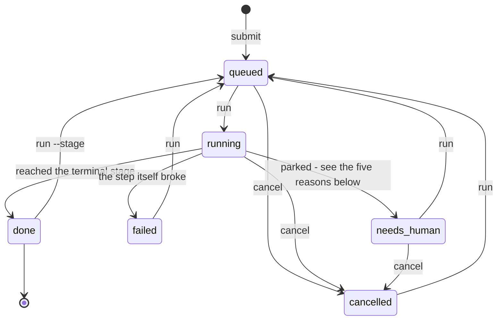

# Operating

Everything after `sf submit`: the states a request moves through, the record every step
leaves behind, and what to do when one of them goes wrong.

A request is a small, durable document on disk, and nothing that happens to it is ever
thrown away — not a failed attempt, not a rejected diff, not the note explaining why. That
is what ties these three sections together: the states are readable, the record is
complete, and a failure is therefore something you look at rather than guess at.

## The request lifecycle

### States



**queued** — submitted, waiting for an engine to pick it up.

**running** — an engine is walking it through its stages. It stays in this state across many
stages and many rework loops; the `stage` field is what moves.

**done** — it reached the terminal stage. The work is the diff in its worktree.

**failed** — the machinery broke: the agent CLI could not be invoked, a step timed out, the
tool returned something unusable. This is an infrastructure problem, not a verdict.

**cancelled** — a human stopped it with `sf cancel <id>`, from `queued`, `running` or
`needs_human` — anything not already finished. The step that was in flight is
signalled (SIGTERM to its whole process group, so `claude` and anything it spawned go with
it), and the engine records the cancellation rather than the failure that the killed step
reports. Nothing is cleaned up: the worktree, the branch and every artifact stay exactly as
they were, which is what makes `sf run <id>` pick it back up where it stood.

A request left in **running** by an engine that was killed is the same situation: `sf run <id>`
clears its claim and re-queues the stage.

**done** is not quite terminal, which is the one edge above worth pointing at. `sf run
<id> --stage <stage>` re-queues a finished request at a named stage — a follow-up on work
already done, keeping its worktree, its branch and its whole history. Without `--stage` it is
refused: there is no step called `done` to re-enter.

#### `needs_human`: the five ways a request parks

Parked, and the reason is recorded on the item so `sf status` shows it in one line.
Five ways to get here, and four reason strings between them — an agent flagging and a judge
failing to decide are one event as far as the engine is concerned. What actually differs is
**whether the stage advanced before it parked**, because that is what decides where
`sf run <id> --note "..."` lands.

| Reason | What happened | Where `run <id>` resumes |
|---|---|---|
| `agent flagged` | **An agent asked.** It returned the `human` verdict — an ambiguous requirement, a destructive operation, a decision that was not its to make. An agent that replied without a parseable verdict lands here too: never guessed at and never retried, because it did answer, it just did not decide. | The **same stage**, with the note in its context. Not a rework pass. |
| `agent flagged` | **A judge could not decide**: no `TYPESAFE_API_KEY`, an HTTP error, a malformed answer, or a rule about a question that came back unanswered. The same reason string, because to the engine it is the same event — a stage said `human` and nothing was routed. | The same stage. |
| `no route for verdict '<v>'` | The stage returned a verdict its edges do not handle — a `fail` on a step that only declares `next:`. This is a pipeline bug, and the fix is in the YAML. | The same stage. |
| `max_passes` | The rework round-trips ran out. The backwards edge was already taken and the pass already counted. | The **rework target** (e.g. `code`), not the stage that failed it. `passes` is still over the limit, so the next backwards edge parks it again — the way out is `--stage` and a change of scope, not another `--note`. |
| `review after <stage>` | A `review: true` gate. The verdict was routed *before* parking, so the stage has already advanced. | The **next** stage; the gated step does not re-run. |

### The human loop

This is the part that matters, because it is what makes an autonomous line safe to leave
running.

A stage that returns `human` stops the request **where it stands**. Its stage does not
advance, its pass counter does not move, its workspace is untouched, and its question is
appended to the request's notes. Nothing is lost and nothing is decided.

`sf status` shows parked requests with their reason, so the human queue is a glance, not
an investigation. `sf show <id>` gives the whole story: every stage, its verdict, its
notes, and the path to the raw agent log.

`sf run <id> --note "<your answer>"` puts the answer into the request's notes — where
the next agent prompt will pick it up — and re-queues it **at the same stage**, which then
runs again, now knowing what it was missing. Unparking is not a rework: the pass counter does
not move, because a human unblocking an agent is not the line failing to converge.

If the answer is that the work should re-enter earlier — the requirement changed, the plan
was wrong — `--stage` sets where it re-enters instead.

### What is kept, per request

- the original request text, its pipeline, its current stage and status
- `passes`, and the park reason if it is parked
- `notes` — every failure and every human answer, in order, all of it fed to later agents
- `history` — one entry per stage execution: verdict, notes, timestamps, duration, cost,
  where it routed to, whether that was rework, and references to its artifacts
- the repo it belongs to, and a worktree on its own branch under
  `~/.sf/worktrees/<repo>/<request>`, where the actual code change lives
- per step, the exact input it was given and the exact output it produced — see
  [the record](#the-record-artifacts-and-replay) below

The consequence worth stating plainly: you can always answer "what is this request doing, and
why is it doing it" from the disk, with no running process and no log aggregation — and after
it finishes, `sf replay` walks the whole run back for you.

## The record: artifacts and replay

A finished run should be answerable after the fact: not just *what did this request end up
as*, but *what exactly was this step asked, what exactly did it say back, and why did the
work go where it went*. That requires the record to be written as the run happens, because
none of it can be reconstructed afterwards — an agent step is not deterministic, so
re-running it answers a different question than the one you are asking.

So every step execution — agent, command or judge — leaves its input, its output and its raw
log behind before the engine moves on.

### What a step records

| Artifact | Agent step | Command step |
|---|---|---|
| `input.md` / `input.sh` | The exact prompt sent, assembled context and all | The exact command |
| `output.md` / `output.txt` | What the agent replied | stdout + stderr |
| `raw.json` | The untouched tool response, including cost and session id | — |
| `exit_code.txt` | What `claude` exited with | The exit code |
| `command.txt` | The invocation, with the prompt elided to `"$(cat input.md)"` — copy, paste, and the step runs again by hand | — |
| `stderr.txt` | Present only when the agent wrote to stderr | — |
| `attempts.txt` | Present only when the reply took more than one attempt: how many it took | — |

`command.txt` and `attempts.txt` are the two that only show up when something went wrong, and
they are the two worth knowing about. An agent that printed nothing at all leaves an empty
`output.md` and an otherwise unexplained failure; `command.txt` is how you reproduce the call
outside the engine, and `attempts.txt` says whether the engine already tried three times.

A judge step has no prompt and no shell, so it records the decision instead:

| Artifact | What it holds |
|---|---|
| `state.json` | Every field that was sent — the request, the notes, the declared inputs, the output of each `state:` command — after truncation |
| `questions.json` | The typed questions, exactly as the pipeline author wrote them |
| `answers.json` | The whole API response: every answer, its confidence, and the token usage the cost was derived from |
| `route.txt` | `<verdict>: <the rule that fired>` — one line, and the only one you usually need |

That set exists because a judgment is a number crossing a threshold, and the number is the
whole argument. `route.txt` says *which* rule fired and on what value
(`secret 0.71 > 0.5 - possible hardcoded credential`); `answers.json` says what the model
actually thought; `state.json` says what it was looking at when it thought it. A threshold
that is wrong is visible from those three files and from nowhere else.

`input` is the one that repays attention. Agents are given a prompt the engine assembles
from four sources — the role prompt, the original request, every note accumulated so far,
and a digest of recent stages. When an agent does something inexplicable, the explanation is
almost always in that file, and almost never in its reply.

A step with an `output:` leaves that file among its artifacts too — one copy per pass. The
working tree only ever holds the latest `_FACTORY/plan.md`; the artifacts hold every version
the planner ever wrote, which is what you want when a rework loop is the thing under
investigation.

Alongside the artifacts, each step records what it did: the stage, whether it was an agent,
a command or a judge, **which runner performed it**, its verdict, its notes, when it started
and ended, how long it took, what it cost, **where it routed to**, and whether that route was
rework. The cost is optional - only a runner that reports one, and that the tool actually
priced, has one; a command step, and an agent run the CLI reported no cost for (subscription
auth, for instance), show `-` rather than `$0.00`, and are left out of the pipeline total. A
reported `$0.00` means it really was free.

A step whose runner could not honour something the stage asked for - no `--resume`, no effort
level - also leaves a `capabilities.txt` saying which. Degrading is allowed; degrading
silently is not.

### On disk

With the local backend, one directory per step execution, numbered in the order they ran:

```
~/.sf/
  state/items/1.json              the item: repo, status, stage, passes, notes, history
  state/items/1/steps/
    001-plan/                     command.txt  exit_code.txt  input.md  output.md  raw.json  plan.md
    002-code/                     command.txt  exit_code.txt  input.md  output.md  raw.json  code.md
    003-test/                     input.sh  output.txt  exit_code.txt  test.log
    004-review/                   command.txt  exit_code.txt  input.md  output.md  raw.json  review.md
    005-plan/                     command.txt  exit_code.txt  input.md  output.md  raw.json  plan.md   <- rework: plan ran twice
  worktrees/test-cli/1/           the git worktree - the actual code change
    _FACTORY/                     the files steps pass to each other; ignores itself
```

The record and the working copy are deliberately apart: artifacts are content the backend
owns and could ship anywhere, while a worktree has to be a real directory on this machine.

A stage that runs twice gets two directories, never one overwritten. That is the whole
point: the interesting question is usually *what was different the second time*.

The history in the item JSON stores **references**, not paths — the local backend happens to
make a reference look like `steps/001-plan/input.md`, but the engine never assumes that. A
remote backend can return object keys instead. See [the storage backend](#the-storage-backend)
below.

### Replay

`sf replay <id>` plays the run back: a summary line, the route actually taken with
rework loops marked, then one block per step with its verdict, duration, cost, notes and
artifact names.

```
1  dev  done   8 steps - 1 rework pass(es) - $1.37 - 4m12s
  plan -> code -> test -> review ~~> code -> test -> review -> commit -> done
```

That second line is the thing worth having. A request that went round twice looks different
from one that went straight through, at a glance, without reading anything.

`--step N` opens one step up and prints its full input and output; `--artifact <name>` picks
out just one. `--json` emits the same timeline flattened, with totals — that is the shape a
visualiser should consume, rather than parsing the human output or reaching into the item
file directly.

### What replay is not

It does not re-execute anything. Replay reads the record; it never calls an agent. Re-running
a step from its recorded input would be a different feature — useful for testing a prompt
change against a real past input, and cheap to add on top of these artifacts, but it answers
"what would happen now", not "what happened then".

Nothing is pruned, either. A long-running factory accumulates every prompt and every reply
it has ever sent, which is exactly what you want while the pipeline design is still moving,
and a retention policy you will want later.

## When something goes wrong

The failure modes that have actually happened on this installation, in the order you are
likely to meet them. Every error string below is one the factory really produces, with the
paths and ids swapped for yours.

Two commands answer most of it. `sf` says what state every request is in;
`sf replay <id> --step N` opens the step that went wrong and prints its stderr, its exit
code and the prompt that produced it.

### `claude` is not on PATH

The engine invokes the agent CLI by name, so a missing one is not caught and does not become
a verdict — the run dies with a Python traceback ending in:

```
FileNotFoundError: [Errno 2] No such file or directory: 'claude'
```

The request is left **running**, with its claim marker still on disk. `sf run <id>`
clears the claim and re-queues the stage; nothing is lost.

Two things cause it. The obvious one is that `claude` is not installed
(`npm install -g @anthropic-ai/claude-code`). The other only bites a **detached** run:
`sf run --detach` forks an engine that inherits the PATH of the shell that started it,
and a `claude` installed only by an interactive shell's rc file is not on it. A plain
`sf run <id>` stays in the foreground with your own PATH, which is the quickest way to
tell the two apart.

### `claude` is on PATH but not authenticated

The CLI exits non-zero and the step records `verdict: error`, so the request goes **failed**
rather than parking. `sf replay <id> --step N` shows the message on stderr.

```bash
claude setup-token                    # once - needs a Claude subscription
export CLAUDE_CODE_OAUTH_TOKEN=...    # the token it printed
```

The token has to be in the environment of whatever runs the engine, which — see above — is
not necessarily the shell you typed `sf run` in. `sf doctor` says whether it is
set where you are standing.

### A run dies on a rate limit

Three requests on this installation died the same evening, mid-`review` and mid-`commit`,
on a session limit. The recorded note (trimmed) reads:

```
claude exited 1: {"is_error":true, ... ,"api_error_status":429,
"result":"You've hit your session limit · resets 1:20am (America/Los_Angeles)", ... }
```

Three things are worth knowing about this one.

**It is not retried.** A non-zero exit from `claude` is treated as configuration rather than
weather, so the request fails immediately instead of burning two more attempts against a
limit that has not reset. The retry path is for a call that exited 0 and still came back
unusable — nothing printed, output that is not JSON, or an error the CLI reported in its own
response.

**The failed call still cost money, and the factory does not record it.** A step that exits
non-zero stores no cost, so `sf status` understates what a rate-limited run spent. The
number is in the step's `raw.json` if you want it.

**The recovery is to wait and re-run.** `sf run <id>` re-queues the request at the stage
that died, with its worktree, its branch and every earlier step's artifacts untouched. If it
keeps happening, lower `concurrency` — several agents against one subscription is exactly
what the limit is counting.

### The test step fails with `command not found`

```
`pytest -q` exited 127
sh: pytest: command not found
```

Same root cause as the first entry, when the run was detached: that engine has the login
shell's PATH, not your virtualenv's. A `run:` step is a plain `sh -c` in the worktree, and the worktree is a fresh
checkout — nothing has activated anything in it.

This is why a test step is worth writing more carefully than `pytest -q`:

```yaml
run: "if [ ! -d tests ] && ! ls test_*.py >/dev/null 2>&1; then echo 'no test suite'; elif [ -x .venv/bin/pytest ]; then .venv/bin/pytest -q; else pytest -q; fi"
```

It decides there is a suite at all before it picks a runner — otherwise a repo with no tests
reads as pytest's exit 5 rather than "no test suite" — and it prefers the repo's own
`.venv/bin/pytest` over whatever is on PATH. Edit that line for your target repo; an absolute
interpreter path is a perfectly good answer.

### A request is parked as `needs_human`

Not a failure. A stage asked a question, or a `review: true` gate is waiting.

```bash
sf                         # the reason, in one line per request
sf replay 7           # the route, and which step HALTED
sf replay 7 --step 4  # the agent's full reply - the actual question
```

Answer it by re-running with a note, or reject the work by naming an earlier stage:

```bash
sf run 7 --note "approved, that key is a test fixture"
sf run 7 --stage plan --note "requirement changed, redo"
```

Where the note lands depends on why it parked — same stage, next stage, or the rework target.
[the five ways a request parks](#needs_human-the-five-ways-a-request-parks) covers all of them.

A bare `sf run` deliberately skips parked requests, so an unanswered question is never
re-run behind your back. `--note` and `--stage` both require an id for the same reason.

### A request is stuck in `running`

An engine was killed — the terminal went away, the machine slept, a step crashed the process.
The item still says `running` and still has its claim marker, so nothing will pick it up.

```bash
sf run 7    # clears the claim and re-queues the stage
```

That is the whole recovery. Nothing is cleaned up on the way through: the worktree, the
branch and every artifact are exactly as the killed run left them.

### `no pipeline 'dev'`

```
sf: no pipeline 'dev' in /Users/you/Projects/api/.sf/pipelines, /Users/you/.sf/pipelines
  no pipelines anywhere yet - write one in .sf/pipelines, or copy one out of the
  examples/ directory in the software-factory repository
```

The message lists every directory that was searched, in order: the repo's own
`.sf/pipelines/` first, then the installation-wide one. **No pipeline ships**, so on a
fresh installation both are empty and the answer is to write one:

```bash
sf init      # creates ~/.sf, its config.yaml and its directories
sf config    # confirms what it can now see
```

Then put a `<name>.yaml` in the repo's `.sf/pipelines/` (it wins) or in `~/.sf/pipelines/`
(every repo). The `examples/` directory in the software-factory repository has four to copy.

A repo with its own `.sf/pipelines/dev.yaml` wins over the global one — deliberately, so
two repos can both have a `dev` and mean different processes. If a pipeline resolves to the
wrong file, that precedence is why, and `sf config` prints both locations.

### `sf/<id>` branches pile up

`sf delete <id>` removes the item, its artifacts and its worktree. It leaves the
`sf/<id>` branch alone, on purpose: the checkout is disposable but the commits on it are
the work, and deleting a request should not be able to destroy the thing the request
produced.

The cost is that a repo worked hard accumulates branches. They are safe to remove once you
have taken what you want off them:

```bash
git -C <repo> branch --list 'sf/*'          # what is there
git -C <repo> branch -D sf/7                # one of them
git -C <repo> worktree prune                     # drop registrations for gone checkouts
```

Ids are never reused, so a deleted request's branch can never be reset by a later one.
