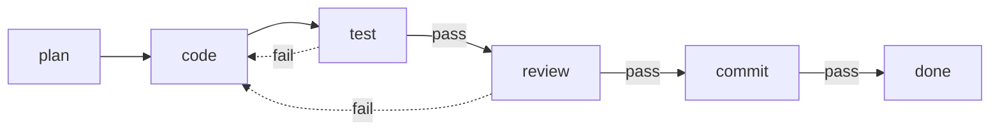

# Pipelines

A pipeline is the process, written down. It names the stages, says what each stage is, and
says where a request goes when a stage is finished with it.

## Stages and edges

Two kinds of edge leave a stage:

- an **unconditional** edge — when this stage passes, go there;
- a **conditional** edge set, keyed by verdict — `pass` goes here, `fail` goes there.

`done` is the implicit terminal stage. The default pipeline looks like this:



Solid edges are forward. Dashed edges are rework.

## The DAG rule

The stages are written in order, and that order is their rank. An edge to a **later** stage
is a forward edge; an edge to an **equal or earlier** stage is a rework edge.

This is what keeps the "acyclic graph" promise honest. The forward edges cannot form a cycle
— they only ever increase in rank — so the happy path is a genuine DAG. Every cycle in the
graph therefore passes through at least one rework edge, and every rework edge is counted.
There is no such thing as an uncounted loop.

## What a stage declares

A stage says **who performs it and what to hand them**, and then where the work goes next.
The vocabulary is GitHub Actions': `uses:` and `with:`.

```yaml
  plan:
    name: Write the plan          # optional human label
    uses: claude                  # which runner does this step
    with:
      prompt: prompts/plan.md
      effort: high
    output: plan.md
    next: code
```

| Key | Meaning |
|---|---|
| `uses:` | Which runner performs this stage. Omitted, the configured default (`claude`). An unknown name fails at load. |
| `with:` | What that runner is handed. `prompt:` for an agent, `run:` for `shell`, `questions:` for `typesafe`; `effort:` and `model:` where the runner can express them. |
| `name:` | A human label, shown by `status` and `replay` instead of the key. Nothing routes on it. |
| `next:` / `on:` | At least one. The unconditional edge, or the edges by verdict. |
| `output:` | A file name. The engine writes what this stage produced to `_FACTORY/<name>`. |
| `input:` | A name, or a list. Read back from `_FACTORY/` and injected into an agent's prompt. |
| `review:` | Park for a human after this stage, whatever it returned. |
| `resume:` | Which agent session to pick up: `true` (default) the last one any stage left, a stage name for that stage's own, `false` for a cold start. |
| `env:` | Environment for this stage's subprocess, over the pipeline's own `env:`. |

Everything left of `with:` is about the *line*; everything inside it is about the *station*.
That is the split: `input:`, `output:`, `resume:`, `review:`, `next:` and `on:` mean the same
thing whoever works the stage, and the prompt file, the shell command and the thinking level
were only ever arguments to one tool.

Above the stages, the file itself declares `name:`, `description:`, `version:`,
`max_passes:`, `concurrency:`, `start:` and `env:`. [`pipeline-schema.yaml`](pipeline-schema.yaml) beside this
page is the whole key list as a JSON Schema — documentation and editor autocomplete, not
a second validator; the loader is the one that enforces.

`output:` and `input:` are how work products travel: the engine writes and reads the files,
so no prompt has to arrange for it and no agent can forget. A missing input is skipped — its
producer may not have run yet — but a name no stage ever produces fails at load, as do
unknown keys and any name trying to escape `_FACTORY/`. See the README for the whole story.

## The runner registry: what `uses:` resolves to

A runner is a YAML file, resolved the way a pipeline is — the repo's own `.sf/runners/` first,
then `~/.sf/runners/`, then the ones packaged with the factory. Three ship built in:
`claude`, `shell` and `typesafe`. `claude` is an ordinary entry, not a special case, which is
the only way to know the seam is real.

```yaml
# agents/codex.yaml
name: codex
description: OpenAI Codex CLI in non-interactive exec mode.
kind: agent
requires: [prompt]                          # the with: keys a step must supply
command: [codex, exec, --json, "{prompt}"]  # exec'd as a list, never through a shell
output:
  format: json            # json | text
  text: result            # where the reply lives in the response
  session: session_id     # optional
  cost: total_cost_usd    # optional
  error: is_error         # optional
options:                  # appended only when the step asks for them
  model:  [--model, "{model}"]
  effort: [--effort, "{effort}"]
  resume: [--resume, "{session}"]
```

`{prompt}` is the assembled prompt text — the role file plus the request, the inputs, the
notes and the verdict block. The named `output:` keys are flat and top-level; a reply that
buries its text under a path is past what a YAML line can describe.

**Capabilities degrade honestly.** A runner with no `options.resume` ignores a step's
`resume:` and starts cold, recording that it did in a `capabilities.txt` artifact rather than
failing; the same for `effort` and `model`. A runner with no `output.cost` records no cost,
which the CLI renders as `-`. An unknown `uses:` fails at load, beside the other wiring errors.

**The verdict is what keeps this honest.** Every agent runner gets the factory's verdict block
appended to its prompt, and the factory parses the JSON object at the end of the reply. That
contract is tool-agnostic, which is precisely why a second CLI can exist at all.

`sf runners` lists every runner it can resolve, whether its binary is on PATH, and which
of model/effort/resume/cost each one supports. `sf doctor` is the other one — it checks
the installation itself, not the runners.

### What this cannot do

A runner file describes argv and a response shape, and nothing deeper. A second CLI is not
Claude Code: different permission models, different session semantics, different JSON. A tool
that streams, needs a TTY, or has its own idea of what a session is will need real work in
`software_factory/runners.py`, not a YAML file. `shell` and `typesafe` are exactly that — Python, one
wrapping `sh -c` and one speaking an HTTP API — registered by name so `uses:` has one meaning.

A runner definition is **executable content from a file**, exactly as `with: {run: ...}` is.
It is exec'd as an argv list and never through a shell, but `agents/` is as much a trust
boundary as `pipelines/`: a repo you would not run `make` in is a repo whose agent definitions
you should not resolve either.

### What `uses:` deliberately does not borrow from Actions

`uses:` invites everything GitHub Actions has. Four things are left out on purpose:

- **`if:` conditions.** The `on:` verdict edges *are* the conditional. A second mechanism
  would fight them, and a stage whose routing is decided in two places is unreadable.
- **`needs:` / `jobs`.** The factory is a state machine with counted rework, not a DAG — the
  backwards edges are the whole design, and a dependency graph cannot express them.
- **Matrix fan-out.** One request walks one line. Fanning out needs a story for merging the
  results back, and nothing has asked for one.
- **`runs-on:`** — a step choosing a container or another machine instead of this host.
  This is the natural next one, and the registry is where it attaches.

## Descriptions

`description:` is optional prose — one or two sentences saying what the pipeline is for and
when to use it. It exists because a name is not enough to choose by: whoever is picking a
pipeline for a request, a person reading `sf config` or an agent choosing one, should
be able to read what the line actually does instead of guessing from `dev` versus `judged`.
Write it for that reader — the triage judge is one of them: `--pipeline auto` offers it every
pipeline on the search path with a description, and this is the text it chooses by. A pipeline
that describes nothing is not offered.

Nothing routes on it. `sf config` prints it under the list of pipelines on disk, and
`sf config --json` carries each pipeline as an object with its `name`, `version` and
`description`.

## Versions

`version:` is an integer the author bumps when the file changes. Nothing pins to it: a
pipeline is resolved from disk every time the engine picks a request up, so editing a
pipeline while requests are in flight changes what they do next — deliberately, because
that is how you fix a broken stage without cancelling the queue.

What the version buys is being able to *see* it afterwards. Each step records the version
it ran under, so a request that spanned an edit reads `dev@1,2` in `sf status` and
its history says exactly which steps ran under which. `sf config` lists the versions on
disk now (`dev v3`), which is a different question and usually the more urgent one.

## Verdicts

Every stage returns one of three verdicts.

| Verdict | Meaning | Effect |
|---|---|---|
| `pass` | This stage is satisfied | Follow the forward edge |
| `fail` | Send it back with my notes | Follow the `fail` edge — usually rework |
| `human` | I need a person | **Halt here.** No routing at all. |

Three and not two, and that is the design decision on this page. A two-verdict line has to
turn every question into a pass or a fail, so an agent facing an ambiguous requirement or an
irreversible operation has no move except to guess, and a guess at stage two is paid for at
stage five. `human` is the move: the request halts where it stands, keeps its workspace and
its pass counter, and waits. Asking is cheap; guessing at scale is not.

The same reasoning is why a missing or unparseable verdict parks rather than defaulting.
Reading silence as `pass` ships unreviewed work; reading it as `fail` spins the loop. Neither
is a decision anybody made.

How a stage states its verdict — the closing JSON object agents are asked for, the stdout
object a `run:` step can emit instead of relying on its exit code — is
[in the README](../README.md#verdicts), with the prompt suffix the engine appends. `review:
true` is the pipeline author requiring a person regardless of the verdict; what that does to
a parked request is in [operating.md](operating.md#needs_human-the-five-ways-a-request-parks).

## Rework, notes, and the pass counter

When a stage fails, two things happen: its notes are appended to the request, and the request
follows the fail edge. Those notes travel with the request forever and are injected into every
later agent's prompt, so the implementer sees exactly why the work came back and the reviewer
can see whether the point was addressed.

If that edge points backwards, the request's `passes` counter increments — it starts at 1,
the request's first pass through the pipeline. When the rework round-trips exceed the
pipeline's `max_passes`, the request stops and waits for a human rather than going round
again.

### Worked example

In a pipeline with a `security` stage after `review`, a request to add an upload endpoint
reaches it, and it finds an API key written into a config file.

1. `security` returns `fail`, notes: *"hardcoded API key in config.py:14, move to env".*
2. The edge `security → plan` points backwards. `passes` goes from 1 to 2.
3. `plan` runs again — same request, now carrying the security note in its prompt.
4. `code` addresses it, `test` passes, `review` passes, `security` passes. `done`.

Had the same finding recurred three more times, the rework round-trips would have exceeded
`max_passes` and the request would have parked with the reason `max_passes` — visible in
`sf status` as a
request needing a person, with its whole failed argument with itself in the history.

## Sessions and cost

An agent stage resumes the session the previous stage left behind, so the whole line is
one conversation: the coder already has the plan it is implementing, the reviewer already
has the diff's history, and none of it is re-read and re-billed. Only the new prompt is
added — inputs and notes are still sent in full, because they say *why* the work came back.

`resume: <stage>` narrows it to that stage's own last session (a reviewer that should
re-enter its own thread rather than the implementer's), and `resume: false` starts cold —
worth it when a stage's judgement should not be coloured by the conversation that produced
the work. A dead session id is never fatal: the call is retried cold.

`with: {effort: ...}` is the third lever, per stage: a commit message does not need the
thinking a plan does, and the stages that route the work (`commit`, a mechanical edit) run
`low`. A runner that cannot express an effort level ignores it and records that it did.

The other lever is the pipeline itself. `software_factory/pipelines/quick.yaml` is code-then-commit, no
plan and no review: two calls instead of five for a request small enough to state exactly.

## What a run actually costs

Numbers from this installation's own history rather than an illustration. Twelve finished
`quick` runs at the time of writing — the two-stage line, `code` then `commit`, worked
against a small Python repository:

| | Cheapest | Median | Dearest |
|---|---|---|---|
| Cost of a run | $1.89 | $4.54 | $9.57 |
| Wall clock | 2m24s | 6m36s | 11m56s |

Per stage, across those same runs: the `code` agent cost $0.78 to $7.76 and took anywhere
from half a minute to twelve; the `commit` agent, which declares `effort: low`, cost $0.16
to $1.81 and finished in under a minute every time. That spread is the point of `effort:` —
the same pipeline, one stage thinking hard and one stage not, and the difference is most of
the bill.

Three things follow, and they are the ones worth planning around.

**A run is minutes, not seconds.** That is why `sf run` detaches instead of holding
your terminal, and why `sf status` exists at all.

**The variance is in the request, not the pipeline.** The $9.57 run and the $1.89 run went
through the same two stages. What differed was how much of the repository the agent had to
read before it could write anything — which is the argument for saying precisely what you
want, and for `--pipeline auto` flagging a request too vague to start on.

**`dev` is five stages, not two.** None of the numbers above are for the full line; expect a
`dev` run to cost several times a `quick` one, and more again if it reworks. A judgment
costs a fraction of a cent against any of this, which is the whole case for
[`judge:`](#the-third-kind-of-stage-judge) stages.

## The third kind of stage: `judge:`

An agent does the work and a command executes; a **judge decides**. It sends the diff and the
scratch files to TypeSafe's System One model as *state*, asks the typed questions the pipeline
author wrote, and turns the answers into `pass` / `fail` / `human` with rules declared as data:

```yaml
  gate:
    uses: typesafe
    with:
      questions: prompts/review-gate.yaml
    input: [plan.md]
    output: gate.md
    on: { pass: review, fail: code }
```

```yaml
# prompts/review-gate.yaml
state:      { diff: "git diff" }          # shell commands; stdout becomes a named state field
questions:
  secret: { type: noul, instructions: "`diff` hardcodes a credential, key, token or password." }
  scope:  { type: score, instructions: "How far does `diff` go beyond `request`?",
            criteria: ["exactly the request", "small extras", "large unrelated changes"] }
route:                                     # first match wins; a rule with no `when` is default
  - { when: secret, above: 0.5, verdict: human, notes: "possible hardcoded credential" }
  - { when: scope,  above: 1.5, verdict: fail,  notes: "goes well beyond the request" }
  - { verdict: pass }
```

`uses: typesafe` is the whole declaration: a stage that reaches a third-party API says so on
the line you read, and the day there is a second judge provider it is another entry in the
registry rather than a second key.

A rule names one question and one comparison — `above:` / `below:` for a `noul` (probability)
or a `score` (position on the ordered levels), `equals:` for a `choice`, and
`confidence_below:` to treat an uncertain answer as its own outcome. The notes the factory
records carry the number that fired: `secret 0.71 > 0.5 - possible hardcoded credential`.

### Thresholds you can tune in one place

A comparison may name a threshold instead of pinning a number — `above: $secret` reads
`typesafe.thresholds.secret` from the config. A gate that turns out to be too eager is then
one edit for the whole installation, rather than the same edit in every questions file in
every repo. A rule that writes a literal still wins, so a pipeline can pin the one number it
cares about and let the installation tune the rest. The shipped `review-gate.yaml` and
`achieved.yaml` are written this way.

A `$name` the config does not define is a wiring bug and parks the request, naming the
threshold it could not find. It is never read as zero: that would make a comparison fire on
every answer there is, silently.

## The `typesafe:` config block

Everything a judge step and submit-time triage need to reach TypeSafe lives under one key in
`~/.sf/config.yaml`. Every key is optional and the block merges one knob at a time — a
file that names only `model:` keeps every other default, and `thresholds:` merges the same
way one level further down.

```yaml
typesafe:
  model: jev-latest
  base_url: https://api.typesafe.ai/v1/systemone
  timeout: 30                    # seconds, per HTTP call
  attempts: 2                    # one retry; a judgment is cheap and idempotent
  price_per_token: 0.000000042   # $0.042 per million input tokens; output is free
  api_key_env: TYPESAFE_API_KEY
  state_max: 60000               # character budget for the state sent with a judgment
  min_confidence: 0.6            # under this, triage's pipeline choice is not taken
  vague: 0.35                    # under this, triage calls a request too vague to start
  thresholds:                    # the names a judge file's `$name` comparisons resolve
    secret: 0.5
    destructive: 0.6
    implements: 0.5
    scope: 1.5
    satisfied: 0.6
    stubbed: 0.6
```

`price_per_token` is the one worth knowing about: it is a dated number that goes stale in
silence, and it is multiplied into every judged step's permanent cost record. When TypeSafe
reprices, set it here rather than waiting for the code to catch up. A questions file can
still override `model:` for its own step; nothing else is per-step.

`sf config --json` prints the whole block as it is in effect.

Why it is worth a stage: a judgment over a diff costs about **$0.0002** against a review
agent's **$1–2**, so a cheap gate before the expensive reviewer pays for itself the first time
it sends an incomplete diff back to `code`. And unlike an agent's verdict, it is not the
worker grading its own work.
Why it is worth a stage, measured rather than asserted. Request 023 on this installation ran
a `gate` judgment over a 7780-token diff for **$0.000327**, in the same run as a review agent
that cost **$0.89**. That is the ratio to design around: roughly three thousand judgments to
one review. A gate in front of the expensive reviewer pays for itself the first time it sends
an incomplete diff back to `code`, and it keeps paying, because the diffs it rejects are the
ones the reviewer would have read most slowly.

The price is a published constant, not a lookup: $0.042 per million input tokens, output
free, recorded in `software_factory/judge.py` with the date it was read. Each step's own cost is
computed from the token count the API reports and stored in its history entry, so
`sf replay` shows what a judgment actually cost rather than what it should have.

The second reason is not about money. A judge is not the worker grading its own work — it
never sees the conversation that produced the diff, only the diff — which is the one thing a
review agent resuming the coder's session structurally cannot offer.

**Opt-in, and it fails closed.** `dev` and `quick` do not use it. It needs `TYPESAFE_API_KEY`;
with no key, an HTTP error, a malformed answer or a rule about a question that was not
answered, the step returns `human` and the request parks — the factory never guesses a
verdict. Every step records `state.json`, `questions.json`, `answers.json` and `route.txt`, so
`sf replay --step N` shows exactly what was asked and which rule fired.

`software_factory/pipelines/judged.yaml` is `dev` with both placements wired up: a `gate` before
`review`, and an `achieved` check before `commit`. The thresholds ship as a first guess and
want calibrating against runs whose outcome you already know — which is `typesafe.thresholds`
in the config, not a copy of the question files.

## Designing a pipeline

Put the cheap gates early: a test suite that fails in seconds should run before a review that
costs minutes and tokens. Point rework edges at the *earliest stage that can actually fix the
problem* — a test failure belongs back at `code`, but a security design flaw belongs back at
`plan`, because no amount of re-coding a bad plan will fix it. And keep `max_passes` low; a
request that needs four attempts is telling you the request itself was unclear.
